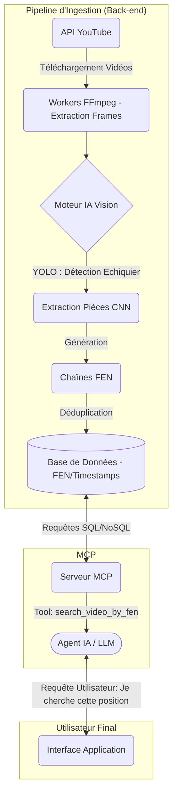

# NOTE DE CADRAGE ET ETUDE DE FAISABILITE : SYSTEME D'ANALYSE VIDEO AVANCE (BOARD-TO-FEN)

**Destinataire :** Direction Technique / Management  
**Objet :** Étude de conception, architecture et faisabilité d'un système de recherche de positions d'échecs spécifiques dans un catalogue de vidéos YouTube via l'utilisation du protocole MCP.

---

## I. ARCHITECTURE GLOBALE ET SOLUTIONS TECHNIQUES

### A. Briques techniques du système
Pour répondre au besoin d'interroger directement un moment précis d'une vidéo correspondant à une position d'échecs donnée, le système doit automatiser l'extraction d'images et leur compréhension. L'architecture s'articule autour des briques suivantes :

1. **Source et Ingestion (API YouTube) :** Une brique chargée de cibler des vidéos (cours, analyses, parties commentées) et de récupérer les flux vidéo bruts.
2. **Workers de traitement vidéo :** Utilisation d'outils comme FFmpeg pour échantillonner la vidéo automatisée (par exemple, 1 image extraite toutes les secondes).
3. **Moteur d'inférence Vision (Board-to-FEN) :** Cœur du système d'analyse. Il conjugue un modèle de détection d'objets (type YOLO) pour localiser l'échiquier dans l'image et un réseau de neurones convolutifs (CNN) pour classifier chaque pièce sur les cases. Ce moteur traduit visuellement l'échiquier en une chaîne de caractères universelle FEN (Forsyth-Edwards Notation).
4. **Logique de déduplication temporelle :** Algorithme permettant d'agréger et de fusionner les séquences. Si la notation FEN à la seconde $T$ est identique à la seconde $T+1$ jusqu'à $T+N$, on génère un segment continu.
5. **Base de données / Index d'objets :** Stockage vectoriel ou relationnel optimisé pour stocker les métadonnées de la vidéo agrégées : `FEN` | `URL Vidéo` | `Timestamp de Début` | `Timestamp de Fin`.
6. **Interface MCP (Model Context Protocol) :** Un serveur léger exposant un outil standardisé (ex: `search_video_by_fen(fen_string)`) à l'Agent IA (le LLM). L'IA peut interroger la base et restituer à l'utilisateur un lien YouTube horodaté (ex: `https://youtube.com/watch?v=id&t=124s`).

### B. Approches d'ingestion de la donnée  
Nous avons évalué deux paradigmes pour le peuplement de cette base :

- **Approche 1 : Ingestion "Batch" (Recommandée)**   
  Constitution volontaire d'une base de données à partir de chaînes YouTube présélectionnées (cours de Grands Maîtres, ouvertures célèbres). Le système processe ces vidéos en asynchrone et le serveur MCP interroge ensuite une base structurellement finie et indexée.  
  ***Avantages :*** Maîtrise des coûts de calcul, pas de redondance de recherche, temps d'inférence utilisateur nul et capacité à analyser tous types de vidéos (pas de limite à une ouverture connue).

- **Approche 2 : Ingestion à la demande**  
  À partir d'une position de l'utilisateur, détection du nom de l'ouverture, recherche des vidéos YouTube correspondantes à la volée, puis analyse des images et restitution.  
  ***Inconvénients :*** Temps d'attente rédhibitoire pour l'utilisateur (plusieurs minutes de traitement vidéo en direct).

### C. Schéma d'architecture technique (Model Context Protocol)
Un schéma d'architecture conceptuel illustrant les flux de données de la base vers le client :

---

## II. BENEFICES ATTENDUS ET LIMITES DU SYSTEME

### A. Bénéfices Stratégiques
- **Structuration puissante de la donnée non structurée :**  
Transformer l'océan de vidéos d'échecs brutes en une ressource pédagogique hautement structurée.   L'utilisateur ne cherche plus dans des tutoriels de 45 minutes : l'IA l'emmène à la seconde exacte. L'apprentissage est contextuel et immédiat.

- **Avantage concurrentiel et Positionnement d'Expert :**  
C'est une fonctionnalité innovante et de niche. Elle positionne notre produit comme le meilleur assistant échiquéen du marché, bien au-delà des moteurs de recherche textuels traditionnels. 

- **Transversalité Multilingue :**   
La notation FEN étant le langage universel des échecs, l'agent peut naturellement proposer une explication issue d'une vidéo russe ou indienne sans barrière linguistique pour la compréhension visuelle et échiquéenne.

### B. Limites Techniques et Points de Vigilance
- **Robustesse du Modèle de Vision :**  
Le moteur se confrontera à des conditions dégradées :
  - Occlusions : mains des joueurs devant l'échiquier sur les plateaux réels.
  - Variations de perspectives : angles de caméra instables, styles de pièces non standards.
  - Transitions logicielles et qualité de la résolution.
- **Puissance de Calcul Requise :**  
Analyser 1 frame par seconde sur des centaines d'heures de vidéo nécessite une sérieuse configuration de GPU, induisant une explosion potentielle des coûts (si cela n'est pas optimisé).
- **Redondance et Stockage :**  
Un problème d'ingénierie se pose si une vidéo affiche l'échiquier fixement pendant 10 minutes (Génération de 600 identités FEN par seconde). L'algorithme de fusion doit être infaillible.
- **Risques Juridiques (Conditions YouTube) :**  
Le téléchargement et l'analyse en masse peuvent enfreindre les conditions d'utilisation de l'API YouTube. Il sera essentiel de garantir que nous ne stockons aucune vidéo, mais uniquement de la métadonnée dérivée (indexation), similairement au fonctionnement d'un moteur de recherche.

---

## III. ETUDE DE FAISABILITE ET ESTIMATION DES COÛTS

Le budget s'articule autour de l'investissement initial de construction de l'architecture (CAPEX) et des coûts récurrents (OPEX). Ce dimensionnement est calculé sur une base cible d'ingestion de **2 heures de vidéo par jour**.

### A. Coûts de Développement et de Mise en Place (CAPEX)
L'investissement de démarrage (Build) est estimé pour un développement continu de **3 mois** (environ 60 jours ouvrés par profil).

- **Ressources Humaines :**
  - 1 Data Scientist / Ingénieur Vision (350 €/j) : Confection, entraînement et optimisation du modèle Board-to-FEN. → **21 000 €**
  - 1 Data Engineer / Dev Backend (370 €/j) : Construction du pipeline de données (workers), de l'infrastructure cloud, et du Serveur MCP. → **22 200 €**
  - *Total RH* : **43 200 €**
- **Infrastructure ML initiale :**  
  Instances cloud pour l'entraînement des modèles (ex: AWS EC2 instances P4/G4). → **~2 000 € (provision)**

**Bilan CAPEX estimé : ~45 200 €**

### B. Performances du Pipeline d'Ingestion
Pour traiter 1 minute de vidéo (à 1 fps, soit 60 images), le pipeline se décompose ainsi :
1. **FFmpeg (Extraction) :** 3–5 s (CPU 8 vCPU) — *Goulot d'étranglement principal mais parallélisable.*
2. **Détection d'échiquier (YOLO / contours) :** ~1 s (GPU T4, batch de 60).
3. **Board-to-FEN (CNN) :** 1–3 s (GPU T4, batch de 60).
4. **Déduplication FEN :** < 0,1 s (CPU).
5. **Écriture BD :** < 0,1 s (Réseau/DB).

**Ratio de traitement mensuel :** Sans optimisation extrême (pipeline naïf), le traitement prend de 5 à 8 secondes par minute de vidéo (vitesse 8x). Pour traiter **120 minutes de vidéo par jour**, le temps d'exécution GPU réel sera d'environ **15 à 20 minutes par jour**. Le traitement des données sera donc un processus très rapide et économe.

### C. Coûts d'Exploitation, Hébergement et Maintenance (OPEX)
Sur la base du traitement cible (2h/jour) et des performances du pipeline, les coûts d'infrastructure sont fortement limités.

- **1. Coût d'ingestion (Workers GPU - AWS G4dn) :**  
  - Instance recommandée : **g4dn.2xlarge** (1× T4 16 Go) à ~0,75 $/h (On-Demand).
  - Pour ~20 min de sollicitation par jour, l'instance sera allumée dynamiquement. 
  - Coût d'exécution : environ 10 heures/mois * 0,75 $.
  - **Coût estimé : ~7,50 $/mois**

- **2. Serveur d'API MCP (AWS EC2) :**
  - Instance recommandée : **t3.medium** (2 vCPU / 4 Go). C'est un composant léger répondant à de simples requêtes d'index.
  - **Coût estimé : ~30 $/mois.**

- **3. Base de Données  :**  
  - Stockage minime (`FEN` | `Timestamp` | `Link` pèse ~200-300 octets. 10 millions d'entrées ≈ 2-3 Go).
  - Instance recommandée : **db.t3.small + 20 Go stockage SSD gp3**.
  - **Coût estimé : ~25 à ~30 $/mois.**

- **4. Coûts API YouTube (Data v3) :**
  - Modèle 100% basé sur quotas (10 000 unités/jour gratuites).
  - Il n'y a pas de tarification de dépassement ; seul un relèvement de quota (gratuit, sur dossier auprès de Google) est appliqué.
  - **Coût estimé : 0 $.**

**Bilan OPEX (infrastructure) estimé : ~70 $ / mois (≈ 65 € / mois).**

---

## IV. RECOMMANDATIONS ET PHASES DE DEVELOPPEMENT

Face aux risques de coûts initiaux prohibitifs et au risque technique de la Vision Assistée par Ordinateur, nous préconisons une stratégie d'intégration par incrément, modulaire et très pragmatique.

### PHASE 1 : Preuve de Concept Textuelle (Le Quick-Win)
Afin de minimiser le financement initial pour un résultat équivalent pour l'utilisateur final, nous parserons automatiquement les descriptions des vidéos et les commentaires YouTube pertinents.  
De nombreux créateurs de contenu mettent à disposition les chapitres d'horodatage, voire les fichiers PGN. Le serveur MCP cherchera ces informations sans aucun traitement d'image. Coût quasi nul, fiabilité à 100%, et permet de valider la traction utilisateur avec un minimum de risques.

### PHASE 2 : Ingestion de vidéos 2D "ScreenCast"
Si la traction utilisateur se confirme, le système implémentera la module de vision de manière restreinte.  
Le système n'étudiera *que* des vidéos issues de plateformes dématérialisées (joueurs filmant leur écran sur Lichess, Chess.com).  
La détection d'éléments nets tracés par ordinateur est facilement résolue par de simples algorithmes informatiques types OpenCV sans avoir besoin d'appliquer de réseaux de neurones complexes ou de GPU coûteux.

### PHASE 3 : The "Real-World" (Tournois et Plateaux 3D physiques)
Déploiement final du modèle YOLO+CNN décrit en section 1.  
Le modèle IA complexe interviendra ici pour parser les vidéos réelles de championnats ou d'ouvertures enregistrées dans la vie physique (3D, conditions lumineuses diverses, bras des joueurs en occlusion).  
Le pipeline modulaire conçu à la Phase 2 permettra le remplacement facile de la brique de parsing sans altérer la base de l'architecture ni le serveur MCP.

