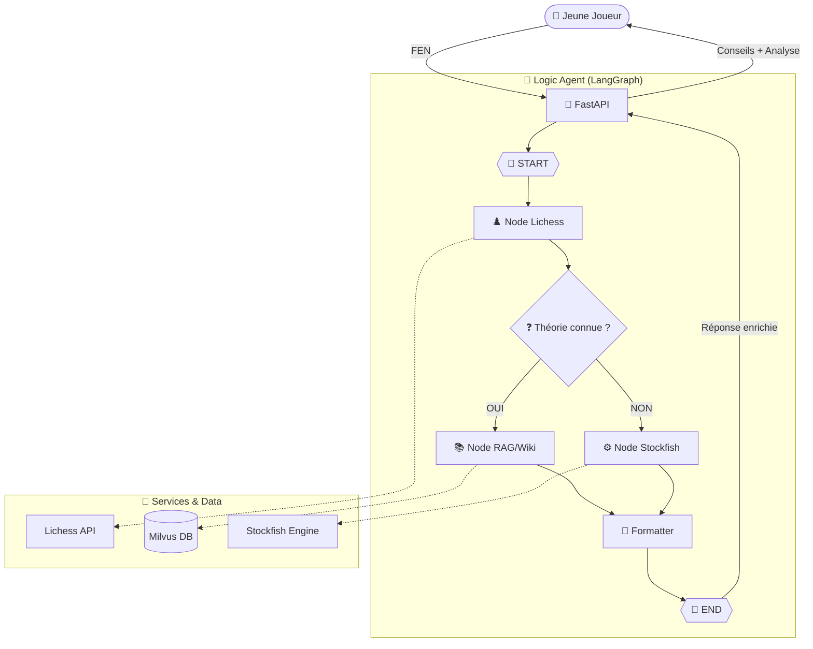

# ♟️ Agent IA FFE — Assistant Ouvertures Jeunes


[](https://www.python.org/)
[](https://fastapi.tiangolo.com/)
[](https://langchain-ai.github.io/langgraph/)
[](https://milvus.io/)
[](https://stockfishchess.org/)
[](https://angular.io/)
[](https://docs.docker.com/compose/)
[]()

> **Projet FFE** : Un agent intelligent conçu pour accompagner les jeunes espoirs dans l'apprentissage et l'analyse de leurs ouvertures aux échecs.

---

## 🎯 Objectif du projet

L'objectif est de fournir un coach virtuel capable d'analyser une position (FEN) en combinant théorie classique et puissance de calcul brute. L'agent guide l'utilisateur en :
- 📖 Identifiant l'ouverture via la **Base Lichess** (Théorie).
- 🧠 Enrichissant la réponse avec du contexte historique via **RAG (Milvus + Wikipedia)**.
- ⚙️ Calculant les meilleurs coups via **Stockfish** si la position sort de la théorie.
- ⏳ Affichant des **vidéos explicatives YouTube** pertinentes à la position en cours

---

## 📐 Architecture Technique

Le coeur de l'application repose sur un orchestrateur **LangGraph** qui gère le flux de décision.



**Sources de données :**
- **Lichess API** : Accès aux bases de données de millions de parties de maîtres.
- **Wikipedia** : Corpus textuel sur les ouvertures (ingéré dans Milvus).
- **Stockfish** : Moteur d'évaluation local pour l'analyse tactique.

---

## 📁 Structure du projet

```
AGENT_IA_FFE/
│
├── 📂 backend/              # Application FastAPI & Logique Agent
│   ├── 🌐 api/              # Endpoints FastAPI (main.py)
│   ├── 🧠 graph/            # Workflow LangGraph de l'agent
│   ├── 📜 schemas/          # Modèles Pydantic / Validation
│   ├── 🛠️ services/         # Logique métier et outils (API Lichess, YouTube)
│   └── 🐳 Dockerfile        # Image Docker spécialisée Backend (Python 3.13)
│
├── 📂 frontend/             # Interface interactive Angular
│   └── 🐳 Dockerfile        # Image Docker spécialisée Frontend (Node.js)
│
├── ⚙️ config/               # Paramètres globaux
│   ├── config.py            # Chemins, URIs, Variables d'env
│   └── logger.py            # Configuration du logging
│
├── 📂 data/                 # Stockage des données locales (si applicable)
├── 🧪 tests/                # Tests unitaires et d'intégration
├── 📜 scripts/              # Scripts utilitaires
├── 🐳 docker-compose.yml    # Orchestration multi-services (API, MongoDB, Milvus)
├── 🔑 .env                  # Variables d'environnement (non versionné)
├── 📦 pyproject.toml        # Dépendances Python (uv)
└── 📜 uv.lock               # Verrouillage des versions
```

---

##  Utilisation & API Endpoints

Une fois le serveur lancé (`uv run uvicorn backend.api.main:api --reload`), la documentation Swagger est accessible sur **`http://127.0.0.1:8000/docs`**.

### 🤖 1. Lancer l'Agent Intelligent (LangGraph)
C'est le point d'entrée principal qui orchestre l'analyse complète (Lichess + Stockfish + RAG).
```bash
curl -X 'POST' \
  'http://127.0.0.1:8000/api/v1/agent' \
  -H 'Content-Type: application/json' \
  -d '{
  "fen": "rnbqkbnr/pppp1ppp/4p3/8/4P3/8/PPPP1PPP/RNBQKBNR w KQkq - 0 2",
  "depth": 15
}'
```

### 📖 2. Obtenir les meilleurs coups théoriques (Lichess)
Interroge uniquement la base de données de parties de maîtres.
```bash
curl -X 'POST' \
  'http://127.0.0.1:8000/api/v1/opening' \
  -H 'Content-Type: application/json' \
  -d '{
  "fen": "r1bqkbnr/pppp1ppp/2n5/1B2p3/4P3/5N2/PPPP1PPP/RNBQK2R b KQkq - 3 3"
}'
```

### ⚙️ 3. Évaluer une position pure (Stockfish)
Évaluation par moteur d'échecs (profondeur paramétrable).
```bash
curl -X 'POST' \
  'http://127.0.0.1:8000/api/v1/evaluate' \
  -H 'Content-Type: application/json' \
  -d '{
  "fen": "r1bqkbnr/pppp1ppp/2n5/1B2p3/4P3/5N2/PPPP1PPP/RNBQK2R b KQkq - 3 3",
  "depth": 12
}'
```

### 🔍 4. Recherche sémantique RAG (Milvus)
Recherche des articles Wikipedia traitant de l'ouverture spécifiée.
```bash
curl -X 'POST' \
  'http://127.0.0.1:8000/api/v1/retrieve' \
  -H 'Content-Type: application/json' \
  -d '{
  "query": "french defence",
  "limit": 2
}'
```

> 💡 *Note : Les positions (FEN) entrantes et les coups renvoyés par les API sont validés via la bibliothèque `python-chess`.*

---

## Installation

### Prérequis

- Python >= 3.13
- Docker & Docker Compose
- Node.js (pour le frontend Angular)

### Installation

#### ⚡ Avec `uv` (recommandé)

```bash
# 1. Cloner le dépôt
git clone https://github.com/RandomFab/AGENT_IA_FFE.git
cd AGENT_IA_FFE

# 2. Créer l'environnement et installer les dépendances
uv sync
```

> `uv` lit le `pyproject.toml` et crée automatiquement le `.venv`. Pas besoin d'activer manuellement l'environnement pour exécuter des commandes — utilisez `uv run <commande>`.

---

#### 🐍 Avec `pip` + `venv` (alternative)

```bash
# 1. Cloner le dépôt
git clone https://github.com/RandomFab/AGENT_IA_FFE.git
cd AGENT_IA_FFE

# 2. Créer et activer l'environnement virtuel
python -m venv .venv
.venv\Scripts\activate        # Windows
# source .venv/bin/activate   # Linux / macOS

# 3. Installer les dépendances
pip install -r requirements.txt
```

### Configuration

```bash
# Copier le fichier d'environnement
cp .env.example .env
# Renseigner les clés API (YouTube, Lichess, LLM...)
```

### Lancement (Docker Compose)

```bash
docker compose up
```

---

## 🔭 Vision long terme — Serveur MCP

En complément du POC, une étude a été menée sur un système de **recherche de vidéos par position FEN** :

1. **Extraction de frames** depuis les vidéos stockées
2. **Détection d'échiquier** sur chaque frame via un modèle de vision (*board-to-FEN*)
3. **Indexation FEN** permettant de retrouver la vidéo et le **timestamp précis** correspondant à une position
4. **Serveur MCP** (Model Context Protocol) pour interfacer ce système avec l'agent

> Cette architecture permettrait de remplacer la simple recherche textuelle YouTube par une recherche sémantique et visuelle sur un catalogue interne de vidéos pédagogiques.

---

## 👤 Auteur

RandomFab - Fabien BARDOUIL
