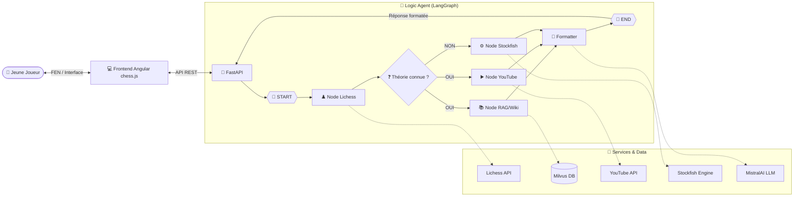

# ♟️ Agent IA FFE — Assistant Ouvertures Jeunes

[](https://www.python.org/)
[](https://fastapi.tiangolo.com/)
[](https://langchain-ai.github.io/langgraph/)
[](https://mistral.ai/)
[](https://milvus.io/)
[](https://stockfishchess.org/)
[](https://github.com/jhlywa/chess.js)
[](https://developers.google.com/youtube/v3)
[](https://angular.io/)
[](https://docs.docker.com/compose/)
[]()

> **Projet FFE** : Un agent intelligent conçu pour accompagner les jeunes espoirs dans l'apprentissage et l'analyse de leurs ouvertures aux échecs.

---

## 🎯 Objectif du projet

L'objectif est de fournir un coach virtuel capable d'analyser une position (FEN) en combinant théorie classique et puissance de calcul brute. L'agent guide l'utilisateur en :
- 📖 Identifiant l'ouverture via la **Base Lichess** (Théorie).
- 🧠 Enrichissant la réponse avec du contexte historique via **RAG (Milvus + Wikipedia)**.
- ⚙️ Calculant les meilleurs coups via **Stockfish** si la position sort de la théorie.
- ⏯️ Affichant des **vidéos explicatives YouTube** pertinentes à la position en cours.
- 📝 Formatant des explications claires et structurées grâce aux modèles de langage de **MistralAI**.
- ♟️ Simulant et manipulant la position en front-end via **chess.js**.

---

## 📐 Architecture Technique

Le coeur de l'application repose sur un orchestrateur **LangGraph** qui gère le flux de décision et une application web interactive **Angular**.



---

## 📁 Structure du projet

Voici la décomposition de l'application (Backend / Frontend).

```text
AGENT_IA_FFE/
│
├── 📂 backend/              # Interface API & Agent IA
│   ├── 🌐 api/              # Endpoints FastAPI (main.py, routes.py)
│   ├── 🧠 graph/            # Workflow LangGraph (agent.py, nodes.py, state.py)
│   ├── 📜 schemas/          # Modèles Pydantic pour validation
│   ├── 🛠️ services/         # Services connecteurs (Lichess, Milvus, YouTube, Stockfish, Format/Mistral)
│   ├── ⚙️ config/           # Configuration globale (logger, vars d'environnement)
│   ├── 📦 pyproject.toml    # Dépendances backend (FastAPI, langchain-mistralai, etc.)
│   └── 🐳 Dockerfile        # Conteneur Python dédié au backend
│
├── 📂 frontend/             # Client Web Angular
│   ├── 📁 src/
│   │   ├── 📁 app/          # Logique front-end
│   │   │   ├── 📁 components/ # Composants UI (chessboard, recommendation-panel)
│   │   │   ├── 📁 services/   # Communication API, Logique échiquéenne (chess.js)
│   │   │   └── app.ts       # Point d'entrée Angular
│   │   └── index.html       # Gabarit HTML
│   ├── 📦 package.json      # Dépendances JS (angular, chess.js)
│   └── 🐳 Dockerfile        # Conteneur Node.js (avec serveur Nginx potentiel)
│
├── 🧪 tests/                # Tests unitaires et d'intégration
├── 📜 scripts/              # Outils ETL (Ingestion Wikipedia vers Milvus, etc.)
└── 🐳 docker-compose.yml    # Orchestrateur de services
```

---

## 📡 Utilisation & API Endpoints

Points de terminaisons accessibles une fois le backend lancé (Swagger sur **`http://127.0.0.1:8000/docs`**). Avant cela, un serveur Milvus doit être actif.

### 🤖 1. Lancer l'Agent Intelligent (LangGraph)
Point d'entrée principal orchestrant toute l'analyse. Ce point interroge MistralAI pour synthétiser le résultat.
```bash
curl -X 'POST' \
  'http://127.0.0.1:8000/api/v1/agent' \
  -H 'Content-Type: application/json' \
  -d '{
  "fen": "rnbqkbnr/pppp1ppp/4p3/8/4P3/8/PPPP1PPP/RNBQKBNR w KQkq - 0 2",
  "depth": 15
}'
```

### 📖 2. Obtenir les meilleurs coups théoriques (Lichess)
Interroge uniquement la base de données de parties de maîtres.
```bash
curl -X 'POST' \
  'http://127.0.0.1:8000/api/v1/opening' \
  -H 'Content-Type: application/json' \
  -d '{
  "fen": "r1bqkbnr/pppp1ppp/2n5/1B2p3/4P3/5N2/PPPP1PPP/RNBQK2R b KQkq - 3 3"
}'
```

### ⚙️ 3. Évaluer une position pure (Stockfish)
Évaluation par moteur d'échecs (profondeur paramétrable).
```bash
curl -X 'POST' \
  'http://127.0.0.1:8000/api/v1/evaluate' \
  -H 'Content-Type: application/json' \
  -d '{
  "fen": "r1bqkbnr/pppp1ppp/2n5/1B2p3/4P3/5N2/PPPP1PPP/RNBQK2R b KQkq - 3 3",
  "depth": 12
}'
```

### 🔍 4. Recherche sémantique RAG (Milvus)
Recherche des articles Wikipedia traitant de l'ouverture spécifiée.
```bash
curl -X 'POST' \
  'http://127.0.0.1:8000/api/v1/retrieve_articles' \
  -H 'Content-Type: application/json' \
  -d '{
  "query": "french defence",
  "limit": 2
}'
```

### 🎥 5. Récupération de vidéos YouTube
Recherche de vidéos pédagogiques relatives à l'ouverture afin d'approfondir l'apprentissage.
```bash
curl -X 'POST' \
  'http://127.0.0.1:8000/api/v1/retrieve_video' \
  -H 'Content-Type: application/json' \
  -d '{
  "opening_name": "french defence",
  "max_results": 2
}'
```

> 💡 *Note : Les positions (FEN) entrantes et les coups renvoyés par les API sont validés via la bibliothèque `python-chess`.*

---

## Installation

### Prérequis

- Python >= 3.13
- Docker & Docker Compose
- Node.js (pour le frontend Angular)

### Installation

#### ⚡ Avec `uv` (recommandé)

```bash
git clone https://github.com/RandomFab/AGENT_IA_FFE.git
cd AGENT_IA_FFE
cp .env.example .env # Puis, configurez VOS CLÉS
```

### 2. Lancer le Backend (avec `uv`)

```bash
cd backend
# uv installe et exécute automatiquement depuis l'environnement projet
uv run uvicorn api.main:api --reload --host 127.0.0.1 --port 8000
```

### 3. Lancer le Frontend (avec `ng serve`)

Dans une seconde boucle de terminal (à la racine du projet) :
```bash
cd frontend
npm install
npm run start # ou "ng serve"
```
> Interface disponible sur `http://localhost:4200` et API sur `http://localhost:8000`.

---

## 🐳 Déploiement avec Docker

Pour lancer le POC de manière unifiée avec des conteneurs isolés (Backend + Milvus/Zilliz localement si intégré au compose, ou Frontend Nginx).

```bash
# Vérifier que le port 8000 et les ports Angular/Nginx (ex: 80, 4200) sont libres
docker-compose up -d --build
```
> 🔹 **Points d'attention `docker-compose.yml` :**
> - Assurez-vous d'avoir bien mappé votre fichier `.env` aux bons conteneurs.
> - Selon votre image `Milvus`, assurez-vous qu'elle est en mode *healthy* avant de requêter l'API LangGraph (sinon le RAG échouera).
> - Le backend nécessite un accès sortant à l'API MistralAI et YouTube.
> - Utilisez la commande `docker-compose logs -f` pour tracer le passage de LangGraph.

---

## 🔭 Vision long terme — Serveur MCP

En complément du POC, une étude a été menée sur un système de **recherche de vidéos par position FEN** :

1. **Extraction de frames** depuis les vidéos stockées
2. **Détection d'échiquier** sur chaque frame via un modèle de vision (*board-to-FEN*)
3. **Indexation FEN** permettant de retrouver la vidéo et le **timestamp précis** correspondant à une position
4. **Serveur MCP** (Model Context Protocol) pour interfacer ce système avec l'agent

> Cette architecture permettrait de remplacer la simple recherche textuelle YouTube par une recherche sémantique et visuelle sur un catalogue interne de vidéos pédagogiques.

📖 **[Lire l'étude de faisabilité complète →](ETUDE_DE_FAISABILITE.md)**

---

## 👤 Auteur

RandomFab - Fabien BARDOUIL
