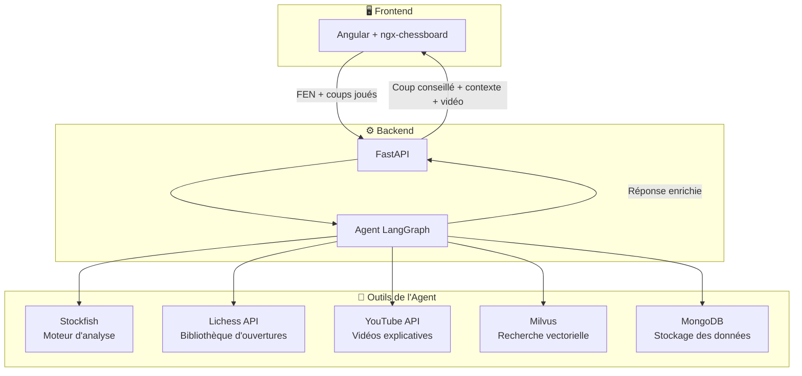

# ♟️ Agent IA FFE — Ouvertures aux Échecs

[](https://www.python.org/)
[](https://fastapi.tiangolo.com/)
[](https://langchain-ai.github.io/langgraph/)
[](https://angular.io/)
[](https://docs.docker.com/compose/)
[]()

> **Proof of Concept** développé pour la **Fédération Française des Échecs (FFE)** — Un agent IA pour accompagner les jeunes espoirs dans l'apprentissage des ouvertures aux échecs.

---

## 🎯 Objectif du projet

La FFE souhaite, en vue des championnats d'Europe jeunes, disposer d'un agent intelligent permettant aux jeunes espoirs de s'entraîner sur les ouvertures aux échecs.

L'agent IA guide l'utilisateur en :
- ✅ Proposant les **meilleurs coups** issus de la théorie des ouvertures
- ✅ Fournissant le **contexte des ouvertures** enrichi par des parties historiques (Lichess)
- ✅ Affichant des **vidéos explicatives YouTube** pertinentes à la position en cours
- ✅ Évaluant la position via **Stockfish** lorsque la partie s'écarte de la théorie

---

## ✨ Fonctionnalités

- ♟️ Interface web avec **échiquier interactif** (Angular + ngx-chessboard)
- 🤖 Agent IA piloté par **LangGraph**, connecté à plusieurs outils spécialisés
- 🔍 Identification de la position par **notation FEN**
- 📚 Consultation de la **bibliothèque d'ouvertures Lichess**
- ♜ Analyse de position par le moteur **Stockfish**
- 🗄️ Recherche vectorielle sur les données d'ouvertures via **Milvus**
- 🎥 Suggestions de vidéos pertinentes via **YouTube API**
- 🐳 Déploiement local via **Docker Compose**

---

## 📐 Architecture



---

## 📁 Structure du projet

```
AGENT_IA_FFE/
│
├── 📂 backend/              # Application FastAPI & Logique Agent
│   ├── 🌐 api/              # Endpoints FastAPI (main.py)
│   ├── 🧠 graph/            # Workflow LangGraph de l'agent
│   ├── 📜 schemas/          # Modèles Pydantic / Validation
│   ├── 🛠️ services/         # Logique métier et outils (API Lichess, YouTube)
│   ├── 📁 vector_db/        # Intégration Milvus / Recherche vectorielle
│   └── 🐳 Dockerfile        # Image Docker spécialisée Backend (Python 3.13)
│
├── 📂 frontend/             # Interface interactive Angular
│   └── 🐳 Dockerfile        # Image Docker spécialisée Frontend (Node.js)
│
├── ⚙️ config/               # Paramètres globaux
│   ├── config.py            # Chemins, URIs, Variables d'env
│   └── logger.py            # Configuration du logging
│
├── 📂 data/                 # Stockage des données locales (si applicable)
├── 🧪 tests/                # Tests unitaires et d'intégration
├── 📜 scripts/              # Scripts utilitaires
├── 🐳 docker-compose.yml    # Orchestration multi-services (API, MongoDB, Milvus)
├── 🔑 .env                  # Variables d'environnement (non versionné)
├── 📦 pyproject.toml        # Dépendances Python (uv)
└── 📜 uv.lock               # Verrouillage des versions
```

---

##  Utilisation & API Endpoints

Une fois le serveur lancé (`uv run uvicorn backend.api.main:api --reload`), la documentation Swagger est accessible sur **`http://127.0.0.1:8000/docs`**.

### 1. Obtenir les meilleurs coups depuis la théorie (Lichess)
```bash
curl -X 'POST' \
  'http://127.0.0.1:8000/api/v1/moves' \
  -H 'Content-Type: application/json' \
  -d '{
  "fen": "r1bqkbnr/pppp1ppp/2n5/1B2p3/4P3/5N2/PPPP1PPP/RNBQK2R b KQkq - 3 3"
}'
```

### 2. Évaluer une position hors théorie (Stockfish)
```bash
curl -X 'POST' \
  'http://127.0.0.1:8000/api/v1/evaluate' \
  -H 'Content-Type: application/json' \
  -d '{
  "fen": "r1bqkbnr/pppp1ppp/2n5/1B2p3/4P3/5N2/PPPP1PPP/RNBQK2R b KQkq - 3 3",
  "depth": 5
}'
```
> 💡 *Note : Les positions (FEN) entrantes et les coups renvoyés par les API sont validés en amont/aval via la bibliothèque `python-chess`.*

---

## Installation

### Prérequis

- Python >= 3.13
- Docker & Docker Compose
- Node.js (pour le frontend Angular)

### Installation

#### ⚡ Avec `uv` (recommandé)

```bash
# 1. Cloner le dépôt
git clone https://github.com/RandomFab/AGENT_IA_FFE.git
cd AGENT_IA_FFE

# 2. Créer l'environnement et installer les dépendances
uv sync
```

> `uv` lit le `pyproject.toml` et crée automatiquement le `.venv`. Pas besoin d'activer manuellement l'environnement pour exécuter des commandes — utilisez `uv run <commande>`.

---

#### 🐍 Avec `pip` + `venv` (alternative)

```bash
# 1. Cloner le dépôt
git clone https://github.com/RandomFab/AGENT_IA_FFE.git
cd AGENT_IA_FFE

# 2. Créer et activer l'environnement virtuel
python -m venv .venv
.venv\Scripts\activate        # Windows
# source .venv/bin/activate   # Linux / macOS

# 3. Installer les dépendances
pip install -r requirements.txt
```

### Configuration

```bash
# Copier le fichier d'environnement
cp .env.example .env
# Renseigner les clés API (YouTube, Lichess, LLM...)
```

### Lancement (Docker Compose)

```bash
docker compose up
```

---

## 🔭 Vision long terme — Serveur MCP

En complément du POC, une étude a été menée sur un système de **recherche de vidéos par position FEN** :

1. **Extraction de frames** depuis les vidéos stockées
2. **Détection d'échiquier** sur chaque frame via un modèle de vision (*board-to-FEN*)
3. **Indexation FEN** permettant de retrouver la vidéo et le **timestamp précis** correspondant à une position
4. **Serveur MCP** (Model Context Protocol) pour interfacer ce système avec l'agent

> Cette architecture permettrait de remplacer la simple recherche textuelle YouTube par une recherche sémantique et visuelle sur un catalogue interne de vidéos pédagogiques.

---

## 👤 Auteur

RandomFab - Fabien BARDOUIL
